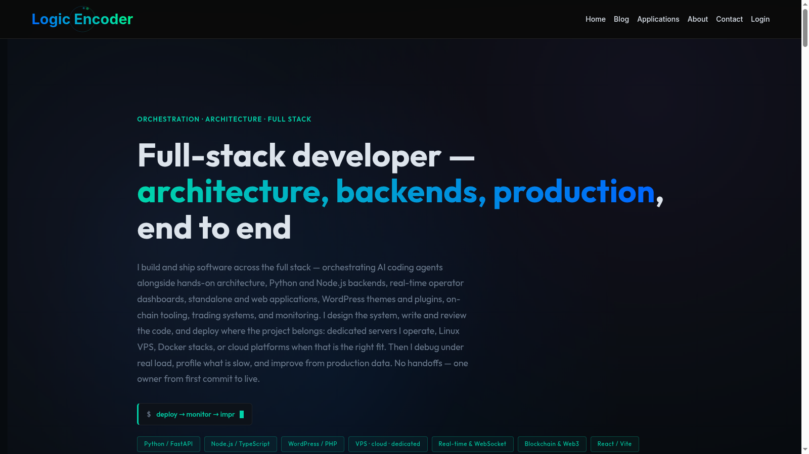

# Logic Encoder Enhanced — site theme

**Custom WordPress theme powering [logicencoder.com](https://logicencoder.com/) — marketing pages, app discovery, blog, and member account routes on one design system, with structure and copy driven from the Customizer instead of PHP deploys.**

The theme is the shared presentation layer for every Logic Encoder surface on the site: landing sections, the applications catalogue, long-form articles, and the gated member area. It exists so operators can reorder homepage blocks, retune colors and typography, swap app cards, and adjust auth layouts without touching templates — and so feature plugins (stats dashboards, shop, login system) inherit one consistent dark visual language.

**Made by [Logic Encoder](https://logicencoder.com)**

Private source: [logicencoder/logic-encoder-theme](https://github.com/logicencoder/logic-encoder-theme)

---

## Tech stack

| Layer | Technologies |
|-------|--------------|
| Platform | WordPress theme (PHP templates + hooks) |
| Styling | Custom CSS design system with token variables |
| Customization | WordPress Customizer — three panels, ~20 sections (`theme_mod` pipeline) |
| Content surfaces | Homepage, app cards, blog index, single posts, auth/account templates |
| Membership | `template_redirect` guards plus gating shortcodes |
| Quality checks | Playwright E2E tests in the private repo |

---

## Customizer control surface

Site structure is edited live under **Appearance → Customize**, grouped into three panels:

| Panel | Sections inside |
|-------|-----------------|
| **Theme** | Brand & colors (preset system sets all tokens at once, Custom keeps manual edits), Layout & spacing, Typography, Effects (background layers, motion, back-to-top), Navigation, Footer |
| **Homepage** | Show/hide per section, SEO, Hero, Engineering approach, Capabilities, Applications block, Application cards manager, Blog preview, Stack, About, CTA strip |
| **Account** | Login page layout, Account page layout |

Each homepage block is independently toggleable and re-editable — a redesign is a Customizer session, not a template change.

## Applications catalogue

The **Application cards manager** stores the product catalogue as theme data — name, description, links, and slot order. Front-end rendering goes through the **`[le_app_cards]`** shortcode, which keeps tool discovery consistent with the site design system wherever it is embedded. Plugin dashboards that live behind shortcode pages inherit the same card styling.

## Blog experience

A dedicated `page-blog` template runs a two-mode index, and `single.php` renders the long-form layout: sticky sidebar, reading progress, share controls, and related-post sections. Technical articles stay readable while keeping the same visual identity as the product pages.

## Member area and content gating

Dedicated templates cover the full account lifecycle: **login, account, dashboard, forgot password, reset password, verify email**, plus about and contact pages. Access control runs on two layers:

- **`template_redirect` guard** — members-only pages redirect visitors to login when configured.
- **Gating shortcodes** — `[members_only]`, `[logged_in_only]`, `[admin_only]`, `[role_only]`, and `[membership_level]` wrap arbitrary content blocks, so a single page can show different sections to guests, members, and staff. Utility shortcodes `[user_info]`, `[login_stats]`, and `[force_logout]` expose account data inside templates.

Integrates with [logicencoder-login-system-plugin](https://github.com/logicencoder/logicencoder-login-system-plugin-overview) for the auth backend; the `logicencoder_login_redirect` filter steers post-login navigation.

## wp-admin surfaces

The theme ships its own admin layer alongside Customizer:

- **Content manager** — replaces the native post list with a purpose-built editor screen (classic view remains one click away).
- **Admin lists** — tuned columns and behaviour on content list screens.
- **Blog Sidebar** — registered widget area for article layouts.
- **Recommended defaults** — a repeatable apply script sets the recommended `theme_mod` baseline and brand color preset on fresh installs.

## SEO integration

Rank Math's conflicting sitemap generation is disabled — the dedicated [sitemap manager plugin](https://github.com/logicencoder/logicencoder-sitemap-manager-plugin-overview) owns XML, with a daily regen hook. Homepage meta comes through [le-settings-plugin](https://github.com/logicencoder/le-settings-plugin-overview), keeping SEO fields editable in one place.

## Plugin ecosystem

The theme provides the shells; feature plugins inject the behaviour:

| Plugin | Theme cooperation |
|--------|-------------------|
| LE Shop | `application` post type archives |
| MEXC / Gate / Gas dashboards | Shortcode pages inherit the dark layout |
| Login System | Auth template routing |
| LE Settings | CSS variables from Customizer + settings API |

## Quality

Playwright E2E tests under `tests/e2e/` in the private repo cover the homepage, auth flows, and app-card regression.

See [REPOS.md](REPOS.md).

---

**Made by [Logic Encoder](https://logicencoder.com)** · [GitHub](https://github.com/logicencoder) · [Contact](https://logicencoder.com/contact/)
